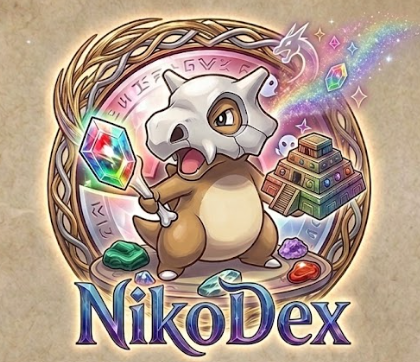

# DOSW-2026-POKEDEX-FRONTEND-NicolasPrietoR

**Proyecto:** Pokédex
**Curso:** Desarrollo y Operaciones de Software (DOSW) · 2026 Intersemestral
**Estudiante:** Nicolas David Prieto Ramos
**Fecha:** 29/06/2026

---

## Enlace al prototipo (Figma)

🔗 [Ver prototipo en Figma](https://www.figma.com/make/J8BH2PiYPdefewUuh0950r/NikoDex-web-app-design?t=g5Pq9m6PQJab6glj-1)

---

## Diagramas de Arquitectura

### Diagrama de Contexto (C4 — Nivel 1)

  

---

### Diagrama de Componentes General (C4 — Nivel 2)

  

---

## Manual de Identidad — NikoDex

---

### 1. Nombre de la Marca

**NikoDex**

NikoDex es una Pokédex digital diseñada para explorar, consultar y gestionar información de Pokémon de forma intuitiva, visual y atractiva. Su identidad combina elementos de aventura, fantasía, exploración y coleccionismo.

---

### 2. Logotipo

  

El logotipo oficial de NikoDex está compuesto por:

- Ilustración de **Cubone** como personaje principal
- **Cristal multicolor** representando el conocimiento y descubrimiento
- Elementos mágicos y ancestrales alrededor del personaje
- Nombre **"NikoDex"** en tipografía fantástica personalizada

**Significado de los elementos:**

| Elemento | Significado |
|---|---|
| Cubone | Perseverancia, crecimiento y espíritu aventurero del entrenador Pokémon |
| Cristal multicolor | Diversidad de tipos Pokémon |
| Círculo rúnico | Conocimiento acumulado de la Pokédex |
| Pirámide y símbolos mágicos | Exploración, misterio y descubrimiento |

---

### 3. Paleta de Colores

**Colores Primarios**

| Color | Hexadecimal | Uso |
|---|---|---|
| Azul Real | `#315A9C` | Botones principales |
| Azul Oscuro | `#1E3B73` | Encabezados |
| Dorado Arena | `#D8B98A` | Fondos y detalles |
| Marrón Cubone | `#B98A63` | Elementos secundarios |

**Colores Secundarios**

| Color | Hexadecimal | Uso |
|---|---|---|
| Verde Esmeralda | `#37C871` | Indicadores positivos |
| Rojo Rubí | `#E64A4A` | Alertas |
| Morado Místico | `#9B6DFF` | Elementos especiales |
| Celeste Cristal | `#7FD8FF` | Destacados |
| Amarillo Energía | `#FFD447` | Acentos |

---

### 4. Tipografía

**Tipografía Principal — Cinzel Decorative**

Utilizada en: Logo, títulos, encabezados y menús principales.

Su estilo fantástico y elegante combina perfectamente con la apariencia mágica y aventurera del logotipo.

**Tipografía Secundaria — Poppins**

Utilizada en: Textos, formularios, tablas y descripciones.

Es moderna, limpia y muy legible, generando contraste con el estilo fantástico de Cinzel Decorative.

**Jerarquía tipográfica**

| Nivel | Tipografía |
|---|---|
| Títulos | Cinzel Decorative Bold |
| Subtítulos | Cinzel Decorative Regular |
| Contenido | Poppins Regular |
| Botones | Poppins SemiBold |

---

### 5. Mascota — Cubone

Cubone es la mascota oficial de NikoDex.

Representa: curiosidad, crecimiento, exploración, aprendizaje y superación.

Puede aparecer en:
- Pantalla de carga
- Página de inicio
- Mensajes vacíos
- Página 404
- Logros y recompensas

---

### 6. Iconografía

La iconografía se inspira en los elementos presentes en el logo con estilo fantasy, Pokémon, místico y de aventura.

| Ícono | Uso |
|---|---|
| 🔍 | Búsqueda |
| ⭐ | Favoritos |
| ⚔️ | Comparaciones |
| 🧬 | Evoluciones |
| 🏆 | Equipos Pokémon |
| 📊 | Estadísticas |
| 🛡️ | Administración |
| 💎 | Pokémon especiales |
| 📖 | Pokédex |
| 🗺️ | Regiones |
| 🎒 | Entrenador |

Los iconos deben tener bordes suaves y apariencia ilustrada.

---

### 7. Estilo Gráfico General

**Concepto visual:** _"Aventura y descubrimiento Pokémon"_

Características:
- Ilustraciones coloridas
- Fondos tipo pergamino moderno
- Tarjetas con bordes redondeados
- Sombras suaves
- Gradientes inspirados en cristales Pokémon
- Elementos decorativos inspirados en runas y símbolos mágicos

Sensaciones que transmite: curiosidad, exploración, coleccionismo, fantasía y diversión.

---

### 8. Uso Correcto de la Marca

| | |
|---|---|
| ✅ | Mantener colores originales |
| ✅ | Mantener proporciones del logotipo |
| ✅ | Utilizar fondos claros o neutros |
| ✅ | Respetar espacio de seguridad alrededor del logo |
| ✅ | Utilizar las tipografías oficiales |
| ✅ | Mantener buena resolución |

---

### 9. Uso Incorrecto de la Marca

| | |
|---|---|
| ❌ | Cambiar los colores del logo |
| ❌ | Deformar el logotipo |
| ❌ | Rotar el logotipo |
| ❌ | Agregar sombras exageradas |
| ❌ | Utilizar tipografías diferentes |
| ❌ | Colocar el logo sobre fondos que dificulten su lectura |
| ❌ | Recortar elementos del logotipo |
| ❌ | Modificar la ilustración de Cubone |
